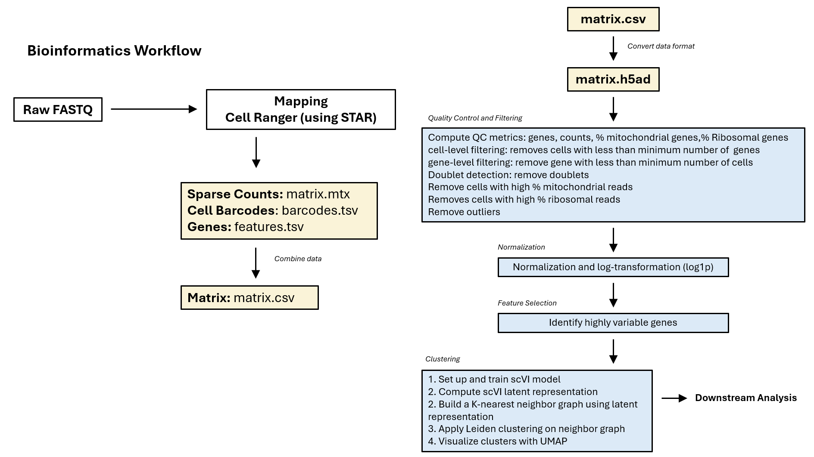
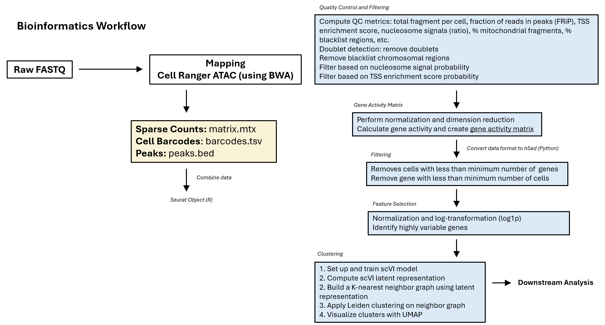
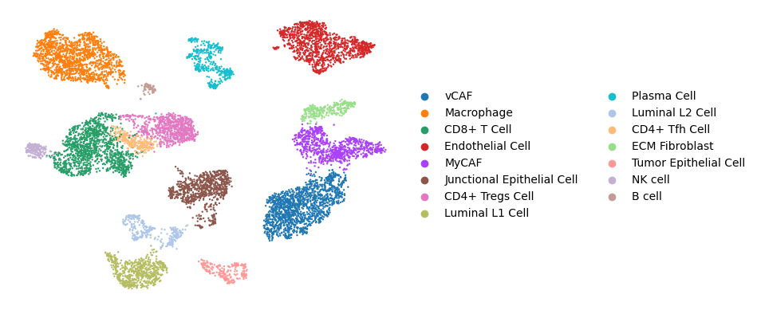
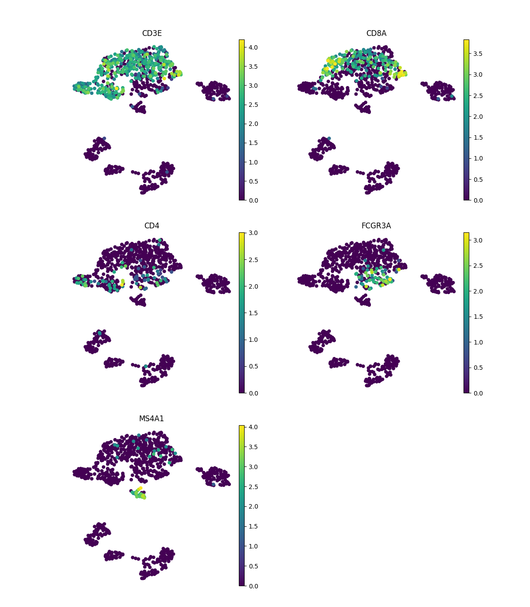
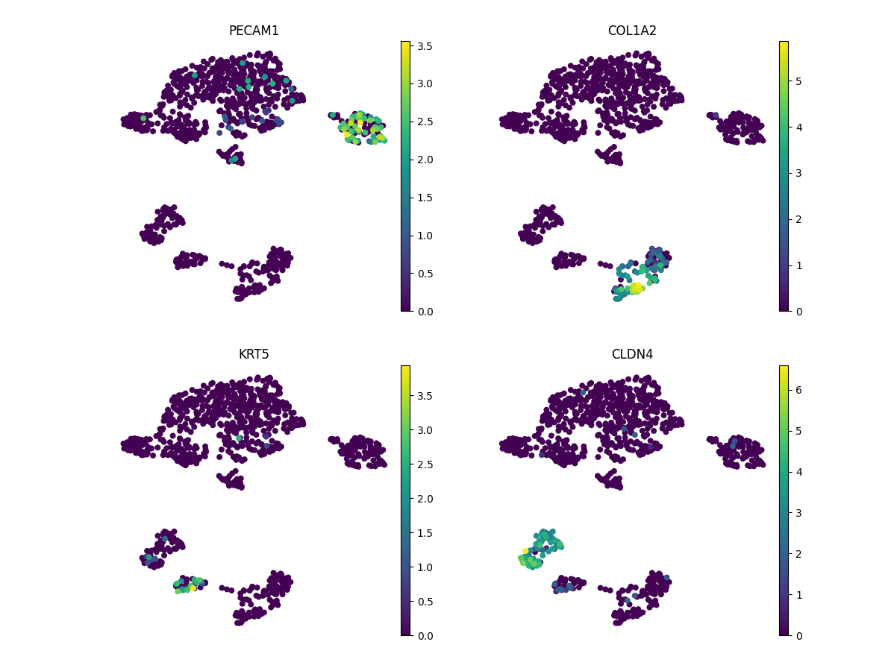
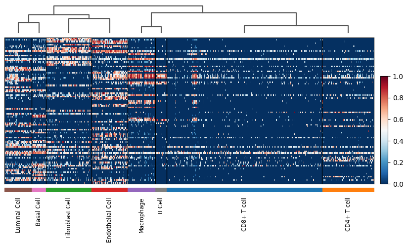
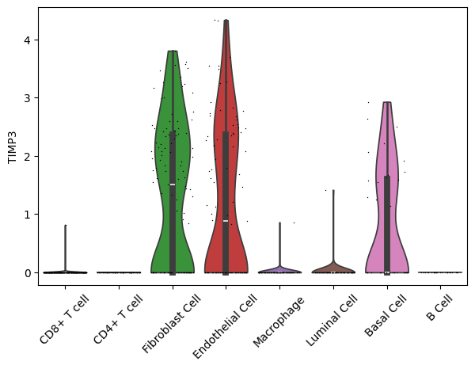
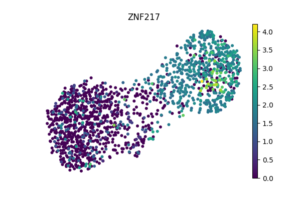
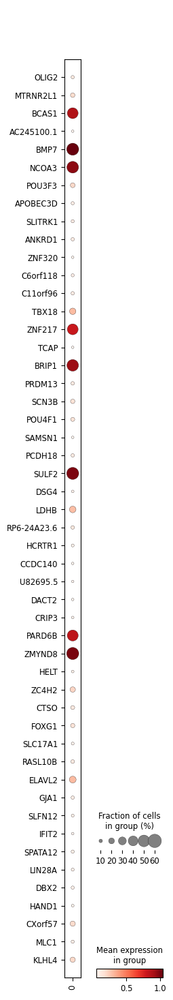

# Single-Cell Transcriptomic and Chromatin Accessibility Profiles of Alternative Polyadenylation Gene Expression in Cell Types of Breast Cancer Microenvironment

 

 

## Table of Contents

I. Introduction

II. Methods

III. Results

IV. Conclusion

V. Technologies

VI. Abbreviation

VII. Acknowledgements

VIII. References

 

## I. Introduction

Single-cell sequencing is a useful technique to study gene regulation of individual cells.  With single-cell RNA-seq (scRNA-seq) and single-cell ATAC-seq (scATAC-seq) datasets publicly available, we further explore alternative polyadenylation, one of the main mechanisms of gene regulation, in a breast cancer model.

 

## II. Methods

**Figure 1**.  Workflow of single-cell RNA-seq.

 

**Figure 2**.  Workflow of single-cell ATAC-seq.

 

**scRNA-seq**.  <i>Datasets</i>.  Raw data (Chromium, 10X Genomics) were obtained from NCBI GEO accession GSE176078 (Wu <i>et al.</i>, 2021).  Samples were sequenced by Illumina sequencer and data (mapped to hg38) were generated using Cell Ranger Single Cell v2.0 (10X Genomics).  Ten samples (estrogen receptor-positive (ER+), primary breast tumor: CID3941, CID4040, CID4463, CID4535; human epidermal growth factor receptor 2-positive (HER2+), primary breast tumor: CID3838, CID3921, CID45171; triple-negative breast cancer (TNBC), primary breast tumor: CID3946, CID4465, CID44041) were selected in this study.  

<i>Data processing</i>.  Data in each sample were first filtered based on minimum number of genes required for each cell (removed if < 200), minimum number of cells required for each gene (removed if < 100), doublet detection using SOLO model (Bernstein <i>et al.</i>, 2020), and outliers (removed if gene count per cell is greater than 98 percentile or less than 2 percentile).  Cells were also removed if mitochondrial and ribosomal gene percentages were greater than or equal to 20%.  Samples were then integrated afterward.  Data were normalized and filtered additionally for highly variable genes prior to transfer learning for cell type annotation.  Cell type reference in breast tissue data (TS_Mammary) from Tabula Sapiens Consortium (Science 376, eabl4896, 2022) was used as training labels.  SCVI model (an unsupervised generative model) was used to train data to learn latent representation, and followed by SCANVI model (a semi-supervised generative model) which was used to predict cell type for unlabled sample cells.  A neighbor graph KNN based on latent representation was built.  Leiden clustering was used to define specific cell type clusters and visualized by UMAP.  Models were implemented with svi-tools in Python. 

**scATAC-seq**.  <i>Datasets</i>.  Preprocessed data (MCF-7 DMSO; 10X single-cell ATAC-seq) were obtained from GEO accession GSE190162 (Bommi-Reddy <i>et al.</i>, 2022).  Sample was sequenced by Illumina sequencer and data (mapped to hg38) were generated using Cell Ranger ATAC (10X Genomics).

<i>Data processing</i>.  Data were further processed using Seurat v5.3.0 (Stuart <i>et al.</i>, 2019; Hao <i>et al.</i>, 2021; Hao <i>et al.</i>, 2023) and Signac v1.14.0 (Suart <i>et al.</i>, 2021) in R and Scanpy (Wolf <i>et al.</i>, 2018) in Python.  Minimum number of genes required for each cell (removed if < 200) and minimum number of cells required for each gene (removed if < 100) were required.  Doublets were removed using scDblFinder v1.16.0 (Germain <i>et al.</i>, 2022).  Cells with a high black-listed gene ratio (greater than or equal to 0.05) were removed, as previously described in the data processing method (Bommi-Reddy <i>et al.</i>, 2022).  The other two quality control metrics of ATAC-seq, namely nucleosome signal and transcriptional start site (TSS) enrichment score, were described in the ENCODE project.  Nucleosome signal is a measure of ratio of mononucleosomal to nucleosome-free fragments (https://www.encodeproject.org/atac-seq/), and TSS enrichment score is a signal-to-noise ratio of reads aggregated at the TSS to those in the flanking regions (https://www.encodeproject.org/data-standards/terms/).  The top 98% and bottom 2% were filtered out based on these two metrics.  Data were normalized.  Singular Value Decomposition (SVD)-based Leiden clustering was performed.  The chromatin accessiblilty peaks were annotated with genes from EnsDB.Hsapiens.v86.  The resultant gene activity matrix was subject to SCVI-based Leiden clustering and UMAP visualization.

 

## III. Results

<i>Single-cell analysis</i>.  <i>scRNA-seq</i>.  A total of 10 primary breast tumor samples were initially processed, consisting of 919 cells and 29,733 genes.  Top 2,000 highly variable genes were selected for further analysis.  Distinct cell types were identified by Leiden clustering.  There were 8 cell type clusters, namely CD8+ T cell, CD4+ T cell, fibroblast cell, endothelial cell, macrophage, luminal cell, basal cell, and B cell (Figure 3A).  Biomarker genes were used to verify the present cluster identity (Figure 3B): CD3E was used as a pan-biomarker for T cells; CD8A for CD8+ T cells; CD4 for CD4+ T cells; FCGR3A for macrophages; MS4A1 for B cells; PECAM1 for endothelial cells; COL1A2 for fibroblast cells; KRT5 for basal cells; CLDN4 for luminal cells.  By profiling gene expression, specific patterns were observed in different cell types (Figure 3C).  <i>scATAC-seq</i>.  A MCF-7 cell line sample was initially processed with 1,588 cells and 15,963 genes.  Top 2,000 high variable genes was analyzed.  ZNF217 (Littlepage <i>et al.</i>, 2012) were selected as a biomarker for MCF-7 (Figure 4A).  Noticeably, there were some cells there were low-expressed or not labeled by the marker genes.  The likely explanation may be due to the additon of DMSO which had been reported to cause changes in cell state in response to stress (Tuncer <i>et al.</i>, 2018; Sangweni <i>et al.</i>, 2021).  Expression pattern of the MCF-7 cell line was displayed in Figure 4B.  <i>APA analysis</i>.  Highly variable expressed genes were matched to the terminal region (TR) genes in PolyADB-v3x-LR database (https://github.com/wcjohnchen/database).  A complete list of TR genes found in scRNA-seq (1,864) and scATAC-seq data (1,789) can be viewed in analyze_data_sc_RNASeq.ipynb and analyze_data_sc_ATACSeq.ipynb, respectively. These APA genes displayed distinct expression patterns in their cell types.

 

**Figure 3**.  scRNA-seq primary breast tumor sample.  **(A)** UMAP representation of cell type clusters (also see interactive UMAP plot).

**(A)**

Interactive UMAP plot: https://wcjohnchen.shinyapps.io/UMAP_SCRNASEQ/

 

**(B)** Cell type identification by biomarker genes: CD3E (T cells), CD8A (CD8+ T cell), CD4 (CD4+ T cell), FCGR3A (macrophage), MS4A1 (B cell), PECAM1 (endothelial cell), COL1A2 (fibroblast cell), KRT5 (basal cell), and CLDN4 (luminal cell).

**(C)** Heatmap of gene expression profile of identified cell types.
 

**(D)** TIMP3 expression in cell types of breast cancer microenvironment.

 

**Figure 4**.  scATAC-seq MCF-7 cell line sample.  **(A)** Identification by biomarker gene ZNF217. **(B)** Dotplot of gene expression profile.  Gene rank based on gene variability (top 50 highly variable genes shown).  0: MCF-7.

**(A)**

**(B)**

 

## IV. Conclusion

The present study used single-cell bioinformatics data processing and analysis techniques to explore candidate genes for alternative polyadenlyation.  Specific 3'UTR APA gene expression patterns were found in different cell population of breast cancer microenvironment.  Further downstream analysis would provide additional glimpse to how APA regulation may contribute to dynamic interaction between cell types in the diseased model.

 

## V. Technologies

Bioinformatics, single-cell RNA-seq, single-cell ATAC-seq, NGS, data analysis, Seurat (R package), Signac (R package), Scanpy (Python), Jupyter Notebook (Python), Python, R, R Shiny, VS Code, Git, Linux

 

## VI. Abbreviation

APA: Alternative polyadenylation  

 

## VII. Acknowledgements

I would like to kindly thank Dr. Bin Tian's lab for data availability on PAS and contribution.

 

## VIII. References

Bernstein NJ, Fong NL, Lam I, Roy MA, Hendrickson DG, and Kelley DR.  2020.  Solo: Doublet Identification in Single-Cell RNA-Seq via Semi-Supervised Deep Learning.  Cell Syst, 11(1):95-101.e5. doi: 10.1016/j.cels.2020.05.010.

Bogard N, Linder J, Rosenberg AB, and Seelig G. 2019.  A Deep Neural Network for Predicting and Engineering Alternative Polyadenylation.  Cell, 178(1):91-106.e23.  doi: 10.1016/j.cell.2019.04.046.

Bommi-Reddy A, Park-Chouinard S, Mayhew DN, Terzo E, Hingway A, Steinbaugh MJ, Wilson JE, Sims RJ 3rd, and Conery AR.  2022.  CREBBP/EP300 acetyltransferase inhibition disrupts FOXA1-bound enhancers to inhibit the proliferation of ER+ breast cancer cells.  PLoS One, 30;17(3):e0262378.  doi: 10.1371/journal.pone.0262378.

Germain PL, Lun A, Garcia Meixide C, Macnair W, and Robinson MD.  2021.  Doublet identification in single-cell sequencing data using scDblFinder.  F1000Res, 10:979. doi: 10.12688/f1000research.73600.2.

Hao Y, Hao S, Andersen-Nissen E, Mauck WM 3rd, Zheng S, Butler A, Lee MJ, Wilk AJ, Darby C, Zager M, Hoffman P, Stoeckius M, Papalexi E, Mimitou EP, Jain J, Srivastava A, Stuart T, Fleming LM, Yeung B, Rogers AJ, McElrath JM, Blish CA, Gottardo R, Smibert P, and Satija R.  2021.  Integrated analysis of multimodal single-cell data.  Cell, 184(13):3573-3587.e29.  doi: 10.1016/j.cell.2021.04.048.

Hao Y, Stuart T, Kowalski MH, Choudhary S, Hoffman P, Hartman A, Srivastava A, Molla G, Madad S, Fernandez-Granda C, and Satija R.  2024.  Dictionary learning for integrative, multimodal and scalable single-cell analysis. Nat Biotechnol, 42(2):293-304.  doi: 10.1038/s41587-023-01767-y.

Littlepage LE, Adler AS, Kouros-Mehr H, Huang G, Chou J, Krig SR, Griffith OL, Korkola JE, Qu K, Lawson DA, Xue Q, Sternlicht MD, Dijkgraaf GJ, Yaswen P, Rugo HS, Sweeney CA, Collins CC, Gray JW, Chang HY, and Werb Z.  2012.  The transcription factor ZNF217 is a prognostic biomarker and therapeutic target during breast cancer progression. Cancer Discov, 2(7):638-51.  doi: 10.1158/2159-8290.CD-12-0093.

Sangweni NF, Dludla PV, Chellan N, Mabasa L, Sharma JR, and Johnson R.  2021.  The Implication of Low Dose Dimethyl Sulfoxide on Mitochondrial Function and Oxidative Damage in Cultured Cardiac and Cancer Cells.  Molecules, 26(23):7305.  doi: 10.3390/molecules26237305.

Stroup EK, and Ji Z. 2023. Deep learning of human polyadenylation sites at nucleotide resolution reveals molecular determinants of site usage and relevance in disease.  Nature Commun, 14(1):7378:1-17.  doi: 10.1038/s41467-023-43266-3.

Stuart T, Butler A, Hoffman P, Hafemeister C, Papalexi E, Mauck WM 3rd, Hao Y, Stoeckius M, Smibert P, and Satija R.  2019.  Comprehensive Integration of Single-Cell Data.  Cell, 177(7):1888-1902.e21.  doi: 10.1016/j.cell.2019.05.031.

Stuart T, Srivastava A, Madad S, Lareau CA, and Satija R.  2022.  Single-cell chromatin state analysis with Signac.  Nat Methods, 18(11):1333-1341.  doi: 10.1038/s41592-021-01282-5.  Erratum in: 2022.  Nat Methods, 19(2):257.  doi: 10.1038/s41592-022-01393-7.

Tunçer S, Gurbanov R, Sheraj I, Solel E, Esenturk O, and Banerjee S.  2018.  Low dose dimethyl sulfoxide driven gross molecular changes have the potential to interfere with various cellular processes.  Sci Rep, 8(1):14828.  doi: 10.1038/s41598-018-33234-z.

Wolf FA, Angerer P, and Theis FJ.  2018.  SCANPY: large-scale single-cell gene expression data analysis.  Genome Biol, 19(1):15.  doi: 10.1186/s13059-017-1382-0. PMID: 29409532; PMCID: PMC5802054.

Wu SZ, Al-Eryani G, Roden DL, Junankar S, Harvey K, Andersson A, Thennavan A, Wang C, Torpy JR, Bartonicek N, Wang T, Larsson L, Kaczorowski D, Weisenfeld NI, Uytingco CR, Chew JG, Bent ZW, Chan CL, Gnanasambandapillai V, Dutertre CA, Gluch L, Hui MN, Beith J, Parker A, Robbins E, Segara D, Cooper C, Mak C, Chan B, Warrier S, Ginhoux F, Millar E, Powell JE, Williams SR, Liu XS, O'Toole S, Lim E, Lundeberg J, Perou CM, and Swarbrick A.  2021.  A single-cell and spatially resolved atlas of human breast cancers.  Nat Genet, 53(9):1334-1347.  doi: 10.1038/s41588-021-00911-1.

