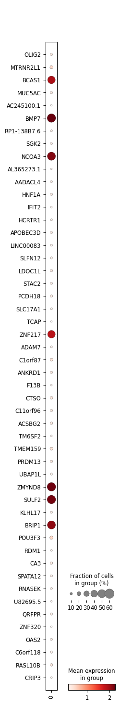
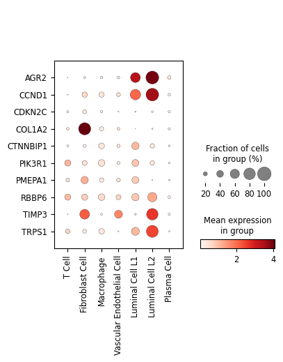

# Single-Cell Transcriptomic and Chromatin Accessibility Profiling Identify Heterogenous Alternative Polyadenylation Gene Expression in Cell Types of Breast Cancer Microenvironment

 

## Table of Contents

I. Introduction

II. Methods

III. Results

IV. Conclusion

V. Technologies

VI. Abbreviation

VII. Acknowledgements

VIII. References

 

## I. Introduction

Single-cell sequencing is a useful technique to study gene regulation of individual cells.  With single-cell RNA-seq (scRNA-seq) and single-cell ATAC-seq (scATAC-seq) datasets publicly available, we further explore alternative polyadenylation, one of the main mechanisms of gene regulation, in a breast cancer model.

 

## II. Methods

Datasets. <i>scRNA-seq</i>: raw data (Chromium, 10X Genomics) were obtained from NCBI GEO accession GSE176078 (Wu <i>et al.</i>, 2021).  Samples were sequenced by Illumina sequencer and data (mapped to hg38) were generated using Cell Ranger Single Cell v2.0 (10X Genomics).  Ten samples (estrogen receptor-positive (ER+), primary breast tumor: CID3941, CID4040, CID4463, CID4535; human epidermal growth factor receptor 2-positive (HER2+), primary breast tumor: CID3838, CID3921, CID45171; triple-negative breast cancer (TNBC), primary breast tumor: CID3946, CID4465, CID44041) were selected in this study.  <i>scATAC-seq</i>: preprocessed data (MCF-7 DMSO; 10X single-cell ATAC-seq) were obtained from GEO accession GSE190162 (Bommi-Reddy <i>et al.</i>, 2022).  Sample was sequenced by Illumina sequencer and data (mapped to hg38) were generated using Cell Ranger ATAC (10X Genomics).

Data processing.  <i>scRNA-seq</i>: data in each sample were first filtered based on minimum number of cells required for each gene (removed if < 10), highly variable genes (kept only top 2,000 genes using Seurat v3 method), doublet detection using SOLO model (Bernstein <i>et al.</i>, 2020), minimum number of genes required for each cell (removed if < 200), and outliers (removed if gene count per cell exceeds 98 percentile).  Cells were also removed if mitochondrial and ribosomal gene percentages were greater than or equal to 20%.  Samples were then integrated afterward.  Data were normalized and filtered additionally for highly variable genes prior to transfer learning for cell type annotation.  Cell type reference in breast tissue data (TS_Mammary) from Tabula Sapiens Consortum (Science 376, eabl4896, 2022) was used as training labels.  SCVI model (an unsupervised generative model) was first used to pre-train data to learn latent representation, and followed by SCANVI model (a semi-supervised generative model) which was used to predict cell type for unlabled sample cells.  UMAP dimensional reduction was performed.  Leiden clustering was used to define specific cell type clusters.  Models were implemented with svi-tools in Python. <i>scATAC-seq</i>: data were further processed using Seurat v5.3.0 (Stuart <i>et al.</i>, 2019; Hao <i>et al.</i>, 2021; Hao <i>et al.</i>, 2023) and Signac v1.14.0 (Suart <i>et al.</i>, 2021) in R and in Python.  Doublets were removed using scDblFinder v1.16.0 (Germain <i>et al.</i>, 2022).  Cells with a high black-listed gene ratio (greater than or equal to 0.05) were removed, as previously described in the data processing method (Bommi-Reddy <i>et al.</i>, 2022).  Mitochondrial and ribosomal genes were removed prior.  The other two quality control metrics of ATAC-seq, namely nucleosome signal and transcriptional start site (TSS) enrichment score, were described in the ENCODE project.  Nucleosome signal is a measure of ratio of mononucleosomal to nucleosome-free fragments (https://www.encodeproject.org/atac-seq/), and TSS enrichment score is a signal-to-noise ratio of reads aggregated at the TSS to those in the flanking regions (https://www.encodeproject.org/data-standards/terms/).  The bottom 2% and top 98% were filtered out based on these two metrics.  Singular Value Decomposition (SVD) was used to reduced the number of variables in the data.  Latent semantic Indexing (LSI) method was used in UMAP dimensional reduction and clustering.  Genes (from EnsDB.Hsapiens.v86) were annotated based on chromatin accessiblilty peaks (gene activity) at the gene location for each cell.

 

## III. Results

<i>Single-cell analysis</i>.  <i>scRNA-seq</i>.  A total of 10 priamry breast tumor samples consisting of 10,318 cells and 2,000 genes were analyzed.  Distinct cell types were identified by leiden clustering.  There were 7 cell type clusters overall, namely fibroblast cell, luminal L1 cell, luminal L2 cell, macrophage, plasma cell, T cell, and vascular endothelial cell (Figure 1A).  Individual sample cells were then mapped to the corresponding cell type clusters (Figure 1B).  Biomarker genes were used to verify the present cluster identity: CD3E for T cell; COL1A2 for fibroblast cell; CD4 for macrophage; PECAM1 for vascular endothelial cell; CLDN4 for luminal L1 cell (Nguyen <i>et al.</i>, 2018); ANKRD30A for luminal L2 cell (Nguyen <i>et al.</i>, 2018); and IGHG1 for plasma cell (Figure 1C).  By profiling gene expression, heterogenity in expression levels were observed in different cell types (Figure 1D).  <i>scATAC-seq</i>.  A MCF-7 cell line sample consisting of 1,643 cells and 2,000 genes was analyzed.  BCAS1 (Dave <i>et al.</i>, 2023), SULF2 (Zhu <i>et al.</i>, 2016), and ZNF27 (Littlepage <i>et al.</i>, 2012) have been used as biomarkers for MCF-7 (Figure 2A).  Noticeably, there were some cells that were either low expressed or not labeled by the marker genes.  The likely explanation may be due to the additon of DMSO which had been reported to cause changes in cell state in reponse to stress (Tuncer <i>et al.</i>, 2018; Sangweni <i>et al.</i>, 2021).  Similarly, heterogenity were also observed, in this case, within the cell type (Figure 2B).

<i>APA analysis</i>.  Highly variable expressed genes were matched to the terminal region (TR) genes in PolyADB-v3x-LR database (https://github.com/wcjohnchen/database).  A complete list of TR genes found in scRNA-seq (1,864) and scATAC-seq data (1,763) can be viewed using a dotplot in analyze_data_sc_RNASeq.ipynb and analyze_data_sc_ATACSeq.ipynb, respectively.  In particular, there are a number of 3'UTR APA genes (104) associated with onocogenes, tumor suppressor genes, and APA regulatory factors that have been reported to play known roles in breast cancer (review paper: <i>Qiao et al.</i>, 2024).  Among those genes, AGR2, CCDN1, CDKN2C, COL1A2, CTNNBIP1, PIK3R1, PMEPA1, RBBP6, TIMP3, and TRPS1 are found in scRNA-seq data; liksewise, CCNE1, PDGFC, PTCH1, RBBP6, SNCA, USP9X, and WT1 are found in scATAC-seq data.  These APA genes displayed distinct expression patterns specific to their cell types.

 

Figure 1.  UMAP presentation of (A) cell type clusters, and (B) samples in scRNA-seq primary breast tumor samples.  (C) Cell type identification by biomarker genes: CD3E (T cell), COL1A2 (fibroblast cell), CD14 (macrophage), PECAM1 (vein endothelial cell), CLDN4 (luminal L1 cell), ANKRD30A (luminal L2 cell), and IGHG1 (plasma cell).  (D) Dotplot of gene expression profile of cell types identified.  Gene rank based on gene variability (tope 25 highly variable genes shown in each group).  0: T-cell; 1: fibroblast cell; 2: macrophage; 3: vascular endothelial cell; 4: luminal L1 cell; 5: luminal L2 cell; 6: plasma cell.

(A)

(B)

(C)

(D)

 

Figure 2.  scATAC-seq MCF-7 cell line sample.  (A) Identification by biomarker genes: BCAS1, SULF2, and ZNF217. (B) Dotplot of gene expression profile.  Gene rank based on gene variability (top 50 highly variable genes shown).  0: MCf-7.

(A)

(B)

 

Figure 3.  Dot plots of previously-reported breast cancer 3'UTR APA genes (Qiao <i>et al.</i>, 2024) in (A) cell types of primary breast tumors using scRNA-seq, and (B) MCF-7 cells using scATAC-seq.

(A)

(B)

 

## IV. Conclusion

The present study used single-cell bioinformatics data processing and analysis techniques to study alternative polyadenlyation.  Heterogeous expression of 3'UTR APA genes were found in different cell population of breast cancer microenvironment, which provides additional glimpse to how APA regulation may contribute to dynamic interaction between cell types in the diseased model.

 

## V. Technologies

Bioinformatics (scRNA-seq, scATAC-seq), Jupyter Notebook, Python, R, VS Code, Git, Linux

 

## VI. Abbreviation

APA: Alternative polyadenylation  

 

## VII. Acknowledgements

I would like to kindly thank Dr. Bin Tian's lab for data availability on PAS and contribution.

 

## VIII. References

Bernstein NJ, Fong NL, Lam I, Roy MA, Hendrickson DG, and Kelley DR.  2020.  Solo: Doublet Identification in Single-Cell RNA-Seq via Semi-Supervised Deep Learning.  Cell Syst, 11(1):95-101.e5. doi: 10.1016/j.cels.2020.05.010.

Bogard N, Linder J, Rosenberg AB, and Seelig G. 2019.  A Deep Neural Network for Predicting and Engineering Alternative Polyadenylation.  Cell, 178(1):91-106.e23.  doi: 10.1016/j.cell.2019.04.046.

Bommi-Reddy A, Park-Chouinard S, Mayhew DN, Terzo E, Hingway A, Steinbaugh MJ, Wilson JE, Sims RJ 3rd, and Conery AR.  2022.  CREBBP/EP300 acetyltransferase inhibition disrupts FOXA1-bound enhancers to inhibit the proliferation of ER+ breast cancer cells.  PLoS One, 30;17(3):e0262378.  doi: 10.1371/journal.pone.0262378.

Dave A, Charytonowicz D, Francoeur NJ, Beaumont M, Beaumont K, Schmidt H, Zeleke T, Silva J, and Sebra R.  2023.  The Breast Cancer Single-Cell Atlas: Defining cellular heterogeneity within model cell lines and primary tumors to inform disease subtype, stemness, and treatment options.  Cell Oncol (Dordr), 46(3):603-628.  doi: 10.1007/s13402-022-00765-7.

Germain PL, Lun A, Garcia Meixide C, Macnair W, and Robinson MD.  2021.  Doublet identification in single-cell sequencing data using scDblFinder.  F1000Res, 10:979. doi: 10.12688/f1000research.73600.2.

Hao Y, Hao S, Andersen-Nissen E, Mauck WM 3rd, Zheng S, Butler A, Lee MJ, Wilk AJ, Darby C, Zager M, Hoffman P, Stoeckius M, Papalexi E, Mimitou EP, Jain J, Srivastava A, Stuart T, Fleming LM, Yeung B, Rogers AJ, McElrath JM, Blish CA, Gottardo R, Smibert P, and Satija R.  2021.  Integrated analysis of multimodal single-cell data.  Cell, 184(13):3573-3587.e29.  doi: 10.1016/j.cell.2021.04.048.

Hao Y, Stuart T, Kowalski MH, Choudhary S, Hoffman P, Hartman A, Srivastava A, Molla G, Madad S, Fernandez-Granda C, and Satija R.  2024.  Dictionary learning for integrative, multimodal and scalable single-cell analysis. Nat Biotechnol, 42(2):293-304.  doi: 10.1038/s41587-023-01767-y.

Littlepage LE, Adler AS, Kouros-Mehr H, Huang G, Chou J, Krig SR, Griffith OL, Korkola JE, Qu K, Lawson DA, Xue Q, Sternlicht MD, Dijkgraaf GJ, Yaswen P, Rugo HS, Sweeney CA, Collins CC, Gray JW, Chang HY, and Werb Z.  2012.  The transcription factor ZNF217 is a prognostic biomarker and therapeutic target during breast cancer progression. Cancer Discov, 2(7):638-51.  doi: 10.1158/2159-8290.CD-12-0093.

Nguyen QH, Pervolarakis N, Blake K, Ma D, Davis RT, James N, Phung AT, Willey E, Kumar R, Jabart E, Driver I, Rock J, Goga A, Khan SA, Lawson DA, Werb Z, and Kessenbrock K.  2018.  Profiling human breast epithelial cells using single cell RNA sequencing identifies cell diversity. Nat Commun, 9(1):2028.  doi: 10.1038/s41467-018-04334-1.

Qiao P, Zhang C, Shi Y, and Du H.  2024.  The role of alternative polyadenylation in breast cancer.  Front Genet, 15:1377275.  doi: 10.3389/fgene.2024.1377275.

Sangweni NF, Dludla PV, Chellan N, Mabasa L, Sharma JR, and Johnson R.  2021.  The Implication of Low Dose Dimethyl Sulfoxide on Mitochondrial Function and Oxidative Damage in Cultured Cardiac and Cancer Cells.  Molecules, 26(23):7305.  doi: 10.3390/molecules26237305.

Stroup EK, and Ji Z. 2023. Deep learning of human polyadenylation sites at nucleotide resolution reveals molecular determinants of site usage and relevance in disease.  Nature Commun, 14(1):7378:1-17.  doi: 10.1038/s41467-023-43266-3.

Stuart T, Butler A, Hoffman P, Hafemeister C, Papalexi E, Mauck WM 3rd, Hao Y, Stoeckius M, Smibert P, and Satija R.  2019.  Comprehensive Integration of Single-Cell Data.  Cell, 177(7):1888-1902.e21.  doi: 10.1016/j.cell.2019.05.031.

Stuart T, Srivastava A, Madad S, Lareau CA, and Satija R.  2022.  Single-cell chromatin state analysis with Signac.  Nat Methods, 18(11):1333-1341.  doi: 10.1038/s41592-021-01282-5.  Erratum in: 2022.  Nat Methods, 19(2):257.  doi: 10.1038/s41592-022-01393-7.

Tunçer S, Gurbanov R, Sheraj I, Solel E, Esenturk O, and Banerjee S.  2018.  Low dose dimethyl sulfoxide driven gross molecular changes have the potential to interfere with various cellular processes.  Sci Rep, 8(1):14828.  doi: 10.1038/s41598-018-33234-z.

Wu SZ, Al-Eryani G, Roden DL, Junankar S, Harvey K, Andersson A, Thennavan A, Wang C, Torpy JR, Bartonicek N, Wang T, Larsson L, Kaczorowski D, Weisenfeld NI, Uytingco CR, Chew JG, Bent ZW, Chan CL, Gnanasambandapillai V, Dutertre CA, Gluch L, Hui MN, Beith J, Parker A, Robbins E, Segara D, Cooper C, Mak C, Chan B, Warrier S, Ginhoux F, Millar E, Powell JE, Williams SR, Liu XS, O'Toole S, Lim E, Lundeberg J, Perou CM, and Swarbrick A.  2021.  A single-cell and spatially resolved atlas of human breast cancers.  Nat Genet, 53(9):1334-1347.  doi: 10.1038/s41588-021-00911-1.

Zhu C, He L, Zhou X, Nie X, and Gu Y.  2016.  Sulfatase 2 promotes breast cancer progression through regulating some tumor-related factors.  Oncol Rep, 35(3):1318-28.  doi: 10.3892/or.2015.4525.

