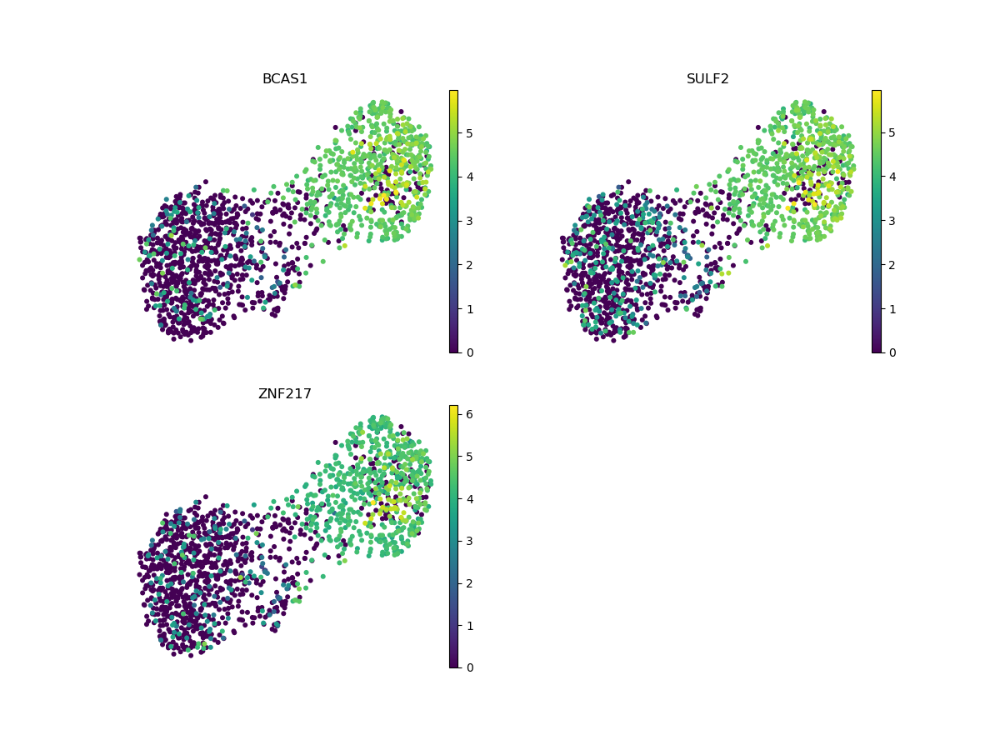

# Single-Cell Transcriptomic and Chromatin Accessibility Profiling Identify Heterogenous Alternative Polyadenylation Gene Expression in Cell Types of Breast Cancer Microenvironment

 

## Table of Contents

I. Introduction

II. Methods

III. Results

IV. Discussion

V. Technologies

VI. Abbreviation

VII. Acknowledgements

VIII. References

 

## I. Introduction

Single-cell sequencing is a useful technique to study gene regulation of individual cells.  With single-cell RNA-seq (scRNA-seq) and single-cell ATAC-seq (scATAC-seq) datasets publicly available, we further explore alternative polyadenylation, one of the main mechanisms of gene regulation, in a breast cancer model.

 

## II. Methods

Datasets. <i>scRNA-seq</i>: raw data (Chromium, 10X Genomics) were obtained from NCBI GEO accession GSE176078 (Wu <i>et al.</i>, 2021).  Samples were sequenced by Illumina sequencer and data (mapped to hg38) were generated using Cell Ranger Single Cell v2.0 (10X Genomics).  Ten samples (ER+, primary breast tumor: CID3941, CID4040, CID4463, CID4535; HER2+, primary breast tumor: CID3838, CID3921, CID45171; triple-negative breast cancer (TNBC), primary breast tumor: CID3946, CID4465, CID44041) were selected in this study.  <i>scATAC-seq</i>: preprocessed data (MCF-7 DMSO; 10X single-cell ATAC-seq) were obtained from GEO accession GSE190162 (Bommi-Reddy <i>et al.</i>, 2022).  Sample was sequenced by Illumina sequencer and data (mapped to hg38) were generated using Cell Ranger ATAC (10X Genomics).

Data processing.  <i>scRNA-seq</i>: data in each sample were first filtered based on minimum number of cells required for each gene (removed if < 10), highly variable genes (kept only top 2,000 genes using Seurat v3 method), doublet detection using SOLO model (Bernstein <i>et al.</i>, 2020), minimum number of genes required for each cell (removed if < 200), and outliers (removed if gene count per cell exceeds 98 percentile).  Cells were also removed if mitochondrial and ribosomal gene percentages were greater than or equal to 20%.  Samples were then integrated afterward.  Data were normalized and filtered additionally for highly variable genes prior to transfer learning for cell type annotation.  Cell type reference in breast tissue data (TS_Mammary) from Tabula Sapiens Consortum (Science 376, eabl4896, 2022) was used as training labels.  SCVI model (an unsupervised generative model) was first used to pre-train data to learn latent representation, and followed by SCANVI model (a semi-supervised generative model) which was used to predict cell type for unlabled sample cells.  UMAP dimensional reduction was performed.  Leiden clustering was used to define specific cell type clusters.  Models were implemented with svi-tools in Python. <i>scATAC-seq</i>: data were further processed using Seurat v5.3.0 (Stuart <i>et al.</i>, 2019; Hao <i>et al.</i>, 2021; Hao <i>et al.</i>, 2023) and Signac v1.14.0 (Suart <i>et al.</i>, 2021) in R and in Python.  Doublets were removed using scDblFinder v1.16.0 (Germain <i>et al.</i>, 2022).  Cells with a high black-listed gene ratio (greater than or equal to 0.05) were removed, as previously described in the data processing method (Bommi-Reddy <i>et al.</i>, 2022).  Mitochondrial and ribosomal genes were removed prior.  The other two quality control metrics of ATAC-seq, namely nucleosome signal and transcriptional start site (TSS) enrichment score, were described in the ENCODE project.  Nucleosome signal is a measure of ratio of mononucleosomal to nucleosome-free fragments (https://www.encodeproject.org/atac-seq/), and TSS enrichment score is a signal-to-noise ratio of reads aggregated at the TSS to those in the flanking regions (https://www.encodeproject.org/data-standards/terms/).  The bottom 2% and top 98% were filtered out based on these two metrics.  Singular Value Decomposition (SVD) was used to reduced the number of variables in the data.  Latent semantic Indexing (LSI) method was used in UMAP dimensional reduction and clustering.  Genes (from EnsDB.Hsapiens.v86) were annotated based on chromatin accessiblilty peaks (gene activity) at the gene location for each cell.  Cell type annotation was performed the same as in the scRNA-seq procedure.

 

## III. Results

PASs in the terminal regions, i.e. the 3'UTR regions, were examined in this study.  There are 247,852 unique TR PASs, which are associated with 29,434 unique genes.  Correlations between PAS features were compared (Figure 1).  The correlations bewtween the three models were as follow: PolyAID vs PolyAStrength: 0.61; PolyAID vs PolyA_SVM: 0.55; and PolyAStrength vs PolyA_SVM: 0.52.  

There are many diseases associated with cleavage and polyadenlyation activites, including cancer, aging, and skin-related diseases.  For example, FIP1L1 gene, which plays a role in leukemia (Ali <i>et al.</i>, 2023), enhances usage of proximal PASs (global 3'UTR shortening), while knockdown of FIP1L1 expression leads to usage of distal PASs (global 3'UTR lengthening) (Davis <i>et al.</i>, 2022, Li <i>et al.</i>, 2015).  By profiling FIP1L1 based on expression level and modeling, PAS genomic locations chr4:+:53459611 (PolyAID: 0.9986, PolyAStrength: 0.5618, PolyA_SVM: 0.9911) and chr4:+:53459667 (PolyAID: 0.9768, PolyAStrength: -7.8462, PolyA_SVM: 0.9750) ranked at the top two (Figure 2).

 

Figure 1.  UMAP presentation of (A) sample, and (B) cell type clusters in scRNA-seq breast tumor samples.  (3) Cell type identification by biomarker genes: CD3E (T cell), COL1A2 (fibroblast cell), CD14 (macrophage), PECAM1 (vein endothelial cell), CLDN4 (luminal L1 cell), ANKRD30A (luminal L2 cell), and IGHG1 (plasma cell).  (D) Dotplot of gene expression profile of cell types identified.  Gene rank based on gene variability (tope 25 highly variable genes shown in each group).  (0) T-cell; (1) fibroblast cell; (2) macrophage; (3) vascular endothelial cell; (4) luminal L1 cell; (5) luminal L2 cell; (6) plasma cell.

(A)

(B)

(C)

(D)

Figure 2.  (A) UMAP presentation of cell type clusters in a scATAC-seq breast tumor sample.  There are two majors clusters: (B) luminal epithelial sell Of mammary gland, and (C) fibroblast Of breast.  (D)

(A)

(B)

(C)

(D)

 

## IV. Conclusion

 

## V. Technologies

Bioinformatics

 

## VI. Abbreviation

PAS: polyA site  

 

## VII. Acknowledgements

 

## VIII. References

Bernstein NJ, Fong NL, Lam I, Roy MA, Hendrickson DG, and Kelley DR.  2020.  Solo: Doublet Identification in Single-Cell RNA-Seq via Semi-Supervised Deep Learning.  Cell Syst, 11(1):95-101.e5. doi: 10.1016/j.cels.2020.05.010.

Bogard N, Linder J, Rosenberg AB, and Seelig G. 2019.  A Deep Neural Network for Predicting and Engineering Alternative Polyadenylation.  Cell, 178(1):91-106.e23.  doi: 10.1016/j.cell.2019.04.046.

Bommi-Reddy A, Park-Chouinard S, Mayhew DN, Terzo E, Hingway A, Steinbaugh MJ, Wilson JE, Sims RJ 3rd, and Conery AR.  2022.  CREBBP/EP300 acetyltransferase inhibition disrupts FOXA1-bound enhancers to inhibit the proliferation of ER+ breast cancer cells.  PLoS One, 30;17(3):e0262378.  doi: 10.1371/journal.pone.0262378.

Germain PL, Lun A, Garcia Meixide C, Macnair W, and Robinson MD.  2021.  Doublet identification in single-cell sequencing data using scDblFinder.  F1000Res, 10:979. doi: 10.12688/f1000research.73600.2.

Hao Y, Hao S, Andersen-Nissen E, Mauck WM 3rd, Zheng S, Butler A, Lee MJ, Wilk AJ, Darby C, Zager M, Hoffman P, Stoeckius M, Papalexi E, Mimitou EP, Jain J, Srivastava A, Stuart T, Fleming LM, Yeung B, Rogers AJ, McElrath JM, Blish CA, Gottardo R, Smibert P, and Satija R.  2021.  Integrated analysis of multimodal single-cell data.  Cell, 184(13):3573-3587.e29.  doi: 10.1016/j.cell.2021.04.048.

Hao Y, Stuart T, Kowalski MH, Choudhary S, Hoffman P, Hartman A, Srivastava A, Molla G, Madad S, Fernandez-Granda C, and Satija R.  2024.  Dictionary learning for integrative, multimodal and scalable single-cell analysis. Nat Biotechnol, 42(2):293-304.  doi: 10.1038/s41587-023-01767-y.

Linder J, Koplik SE, Kundaje A, and Seelig G. 2022.  Deciphering the impact of genetic variation on human polyadenylation using APARENT2.  Genome Biol, 23(1):232.  doi: 10.1186/s13059-022-02799-4.

Stroup EK, and Ji Z. 2023. Deep learning of human polyadenylation sites at nucleotide resolution reveals molecular determinants of site usage and relevance in disease.  Nature Commun, 14(1):7378:1-17.  doi: 10.1038/s41467-023-43266-3.

Stuart T, Butler A, Hoffman P, Hafemeister C, Papalexi E, Mauck WM 3rd, Hao Y, Stoeckius M, Smibert P, and Satija R.  2019.  Comprehensive Integration of Single-Cell Data.  Cell, 177(7):1888-1902.e21.  doi: 10.1016/j.cell.2019.05.031.

Stuart T, Srivastava A, Madad S, Lareau CA, and Satija R.  2022.  Single-cell chromatin state analysis with Signac.  Nat Methods, 18(11):1333-1341.  doi: 10.1038/s41592-021-01282-5.  Erratum in: 2022.  Nat Methods, 19(2):257.  doi: 10.1038/s41592-022-01393-7.

Wu SZ, Al-Eryani G, Roden DL, Junankar S, Harvey K, Andersson A, Thennavan A, Wang C, Torpy JR, Bartonicek N, Wang T, Larsson L, Kaczorowski D, Weisenfeld NI, Uytingco CR, Chew JG, Bent ZW, Chan CL, Gnanasambandapillai V, Dutertre CA, Gluch L, Hui MN, Beith J, Parker A, Robbins E, Segara D, Cooper C, Mak C, Chan B, Warrier S, Ginhoux F, Millar E, Powell JE, Williams SR, Liu XS, O'Toole S, Lim E, Lundeberg J, Perou CM, and Swarbrick A.  2021.  A single-cell and spatially resolved atlas of human breast cancers.  Nat Genet, 53(9):1334-1347.  doi: 10.1038/s41588-021-00911-1.

